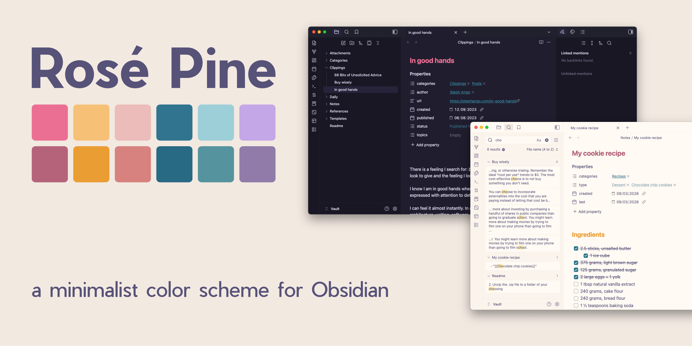
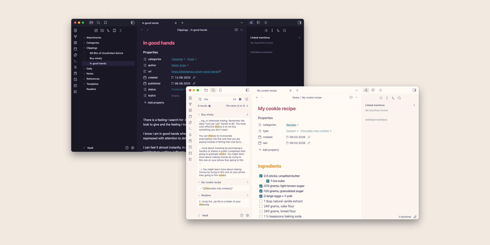

# Rosé Pine for Obsidian

A clean, minimal Obsidian theme that brings the beautiful [Rosé Pine](https://rosepinetheme.com) palette to your notes; soft, cozy, and easy on the eyes.

- **Dark mode**: Main variant of Rosé Pine; all natural pine, faux fur, and a bit of Soho vibes.
- **Light mode**: Dawn variant of Rosé Pine; gentle, warm, and readable for daytime use.
- **Zero bloat**: changes colors only, preserves Obsidian’s native feel.

